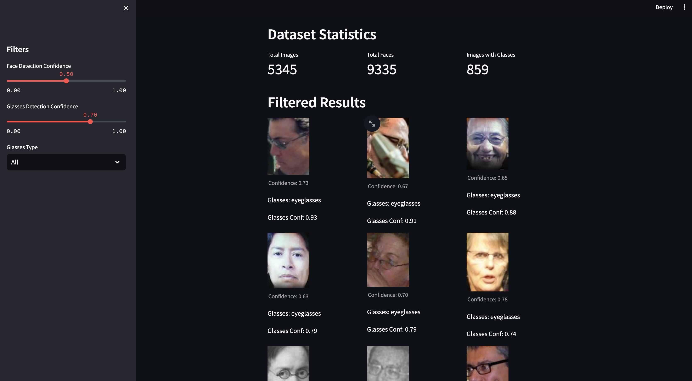

# homeassignment-StabilityAI-

A comprehensive pipeline for detecting faces and eyeglasses in images using YOLOv8 and CLIP models.



## Features

- Face detection using YOLOv8
- Eyeglasses classification using CLIP
- Batch processing of images
- Face verification using heuristics
- Detailed logging and statistics
- Interactive web interface for dataset exploration

## System Requirements

- Python 3.8 or higher
- CUDA-capable GPU (recommended)
- 8GB+ RAM
- 10GB+ free disk space

## Installation

1. Clone the repository:
```bash
git clone https://github.com/Manireddy1508/homeassignment-StabilityAI-.git
cd homeassignment-StabilityAI-
```

2. Create and activate a virtual environment:
```bash
python -m venv venv
source venv/bin/activate  # On Windows: venv\Scripts\activate
```

3. Install dependencies:
```bash
pip install -r requirements.txt
```

4. Download required models:
```bash
python scripts/download_models.py
```

## 🚀 Implementation Steps

### Model Download
Download required models (YOLOv8n-face and CLIP):
```bash
python scripts/download_models.py
```
Or specify a custom directory:
```bash
python scripts/download_models.py --models-dir test_downloads
```

### 1. Download WIT Dataset
```bash
# Download WIT dataset metadata
python scripts/download_wit.py
```
This will:
- Download the WIT dataset metadata
- Create necessary directories
- Set up the data structure

### 2. Download Images
```bash
# Download images from WIT dataset
python scripts/download_images.py
```
This will:
- Download images from WIT dataset
- Filter images based on metadata
- Save images to the data directory

### 3. Run Face Detection Pipeline
```bash
# Run the face detection pipeline
python scripts/detect_faces_and_glasses.py \
    --input-dir data/raw \
    --output-dir data/processed \
    --confidence-threshold 0.5 \
    --batch-size 32 \
    --use-clip \
    --save-glasses
```
This will:
- Detect faces in images using YOLOv8
- Classify glasses using CLIP
- Save results to Parquet files

### 4. Upload to Hugging Face
```bash
# Upload processed dataset to Hugging Face
python scripts/upload_to_huggingface.py
```
This will:
- Process the results
- Create the dataset
- Upload to Hugging Face

### 5. Run Web Interface
```bash
# Start the Streamlit web interface
streamlit run scripts/app.py
```
This will:
- Start the web server
- Allow you to browse the dataset
- View detection results


### Dataset Access
The processed dataset is available on Hugging Face:
- Repository: `Manireddy1508/glasses-detection-dataset`
- Access: Private repository
- To request access:
  1. Create a Hugging Face account if you don't have one
  2. Contact the repository maintainers with your Hugging Face username
  3. You will be granted access to the private dataset

The dataset includes:
- Filtered images with faces wearing eyeglasses
- Face detection and glasses classification metadata
- Confidence scores and bounding boxes
- Base64-encoded thumbnails for quick preview

### Dataset Card
The dataset is stored in Parquet format with the following structure:

#### Dataset Description
This dataset contains processed results from a face and glasses detection pipeline. It includes:
- Face detection results using YOLOv8
- Glasses classification using CLIP
- Bounding box coordinates
- Confidence scores
- Image metadata

#### Dataset Structure
The dataset is stored in Parquet format with the following columns:
- `image_path`: Path to the original image
- `faces`: List of detected faces, each containing:
  - `bbox`: Bounding box coordinates [x1, y1, x2, y2]
  - `confidence`: Face detection confidence score
  - `is_eyeglasses`: Boolean indicating if glasses were detected
  - `eyeglasses_conf`: Confidence score for glasses detection
  - `thumbnail`: Base64 encoded face thumbnail

#### Usage Example
```python
from datasets import load_dataset

# Load the dataset
dataset = load_dataset("Manireddy1508/glasses-detection-dataset")

# Access the data
for item in dataset['train']:
    print(f"Image: {item['image_path']}")
    for face in item['faces']:
        print(f"  Face confidence: {face['confidence']:.2f}")
        print(f"  Has glasses: {face['is_eyeglasses']}")
        print(f"  Glasses confidence: {face['eyeglasses_conf']:.2f}")
```

#### Source Data
The original images were sourced from the Wikipedia-based Image Text (WIT) dataset and processed using:
- YOLOv8 for face detection
- CLIP for glasses classification
- Custom face verification heuristics

#### License
This dataset is provided under the same license as the original WIT dataset.

#### Citation
If you use this dataset, please cite:
```
@misc{glasses-detection-dataset,
  author = {Manireddy},
  title = {Glasses Detection Dataset},
  year = {2024},
  publisher = {Hugging Face},
  journal = {Hugging Face Hub},
  howpublished = {\url{https://huggingface.co/datasets/Manireddy1508/glasses-detection-dataset}}
}
```

### Web Interface
Explore the dataset interactively:
```bash
streamlit run scripts/app.py
```

### Dataset Filtering System
The project includes a comprehensive filtering system for researchers:

1. **Interactive Web Interface**
   - Filter by face detection confidence
   - Filter by glasses detection confidence
   - Filter by glasses type (Eyeglasses, Sunglasses, No Glasses)
   - View dataset statistics (total images, faces, glasses)
   - Browse filtered results in a grid layout
   - See confidence scores and annotations

2. **Command-line Tools**
   ```bash
   python scripts/display_glasses_images.py \
       --parquet data/processed/glasses.parquet \
       --min-confidence 0.7 \
       --show-thumbnails
   ```
   - Filter images by minimum confidence threshold
   - View thumbnails or full images
   - Browse through results interactively

3. **Data Organization**
   - Results saved in Parquet format with structured metadata:
     - Image paths and face bounding boxes
     - Confidence scores for face and glasses detection
     - Glasses type classification
     - Base64-encoded thumbnails
     - Face verification results

4. **Dataset Access**
   - Upload to Hugging Face for easy sharing
   - Dataset card with documentation
   - Test scripts for dataset access

## Project Structure

```
.
├── config/                 # Configuration files
├── data/                   # Data directories
│   ├── raw/               # Raw input images
│   ├── processed/         # Processed images
│   ├── glasses_images/    # Extracted glasses images
│   └── final/             # Final output
├── models/                # Model weights and configurations
├── scripts/               # Python scripts
│   ├── detect_faces_and_glasses.py  # Main detection script
│   ├── test_single_image.py        # Single image testing
│   ├── display_glasses_images.py   # Visualization script
│   ├── download_images.py          # Image downloader
│   ├── download_wit.py            # WIT dataset downloader
│   ├── download_models.py         # Model downloader
│   ├── upload_to_huggingface.py   # Dataset upload script
│   ├── create_dataset_card.py     # Dataset documentation
│   ├── test_dataset_access.py     # Dataset testing
│   └── app.py                     # Streamlit web interface
├── utils/                 # Utility modules
│   ├── face_filter.py    # Face verification
│   ├── clip_utils.py     # CLIP model utilities
│   └── glasses_utils.py  # Glasses detection utilities
├── requirements.txt      # Python dependencies
└── README.md            # Project documentation
```

## Models

### YOLOv8n-face
- Used for face detection
- Lightweight and fast
- Included in the repository

### CLIP (ViT-B/32)
- Used for glasses classification
- Downloaded automatically
- Stored in safetensors format

## Face Verification

The pipeline includes a two-step face verification process to ensure high-quality face detection:

### Initial Verification
- Minimum face size: 100x100 pixels
- Edge margin: 10% from image boundaries
- Maximum face size: 80% of image dimensions
- Aspect ratio: Between 0.5 and 2.0

### Advanced Verification (FaceFilter)
- Additional size validation
- Aspect ratio verification (0.5 to 2.0)
- Contrast check (minimum threshold of 20)
- Grayscale analysis for quality assessment
- Early rejection of invalid faces

## Logging

All operations are logged to:
- Console output
- `glasses_detection.log` file

## Performance

- Face detection: ~30ms per image (on GPU)
- Glasses classification: ~50ms per face (on GPU)
- Batch processing supported for better throughput

## Contributing

1. Fork the repository
2. Create a feature branch
3. Commit your changes
4. Push to the branch
5. Create a Pull Request

Contributions are welcome! If you have suggestions for improvements, new features, or bug fixes, please feel free to open an issue or submit a pull request.

## License

This project is open-source

## 🚀 Implementation

### 1. Download Required Models
```bash
# Download YOLOv8 face detection model
python scripts/download_models.py
```

### 2. Download WIT Dataset
```bash
# Download WIT dataset metadata
python scripts/download_wit.py
```
This will:
- Download the WIT dataset metadata
- Create necessary directories
- Set up the data structure

### 3. Download Images
```bash
# Download images from WIT dataset
python scripts/download_images.py
```
This will:
- Download images from WIT dataset
- Filter images based on metadata
- Save images to the data directory

### 4. Run Face Detection Pipeline
```bash
# Run the face detection pipeline
python scripts/run_pipeline.py
```
This will:
- Detect faces in images using YOLOv8
- Classify glasses using CLIP
- Save results to Parquet files

### 5. Upload to Hugging Face
```bash
# Upload processed dataset to Hugging Face
python scripts/upload_to_hf.py
```
This will:
- Process the results
- Create the dataset
- Upload to Hugging Face

### 6. Run Web Interface
```bash
# Start the Streamlit web interface
streamlit run app.py
```
This will:
- Start the web server
- Allow you to browse the dataset
- View detection results

## 📊 Dataset Access

The processed dataset is available on Hugging Face:
- Repository: `Manireddy1508/glasses-detection-dataset`
- Access: Private repository
- To request access:
  1. Create a Hugging Face account if you don't have one
  2. Contact the repository maintainers with your Hugging Face username
  3. You will be granted access to the private dataset

The dataset includes:
- Filtered images with faces wearing eyeglasses
- Face detection and glasses classification metadata
- Confidence scores and bounding boxes
- Base64-encoded thumbnails for quick preview
